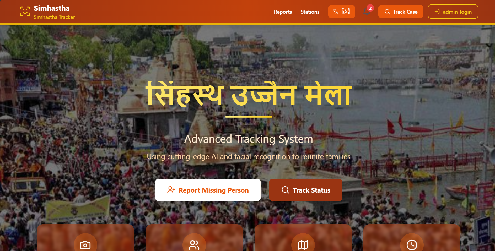
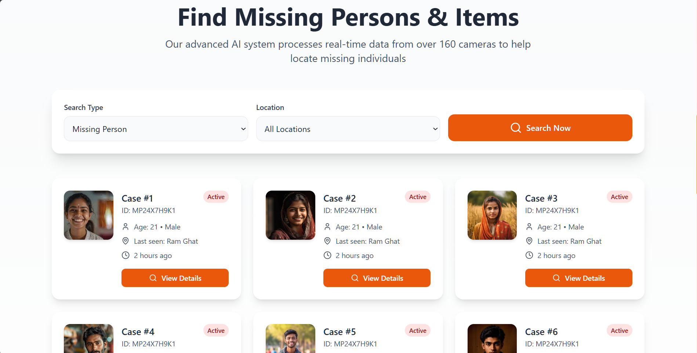
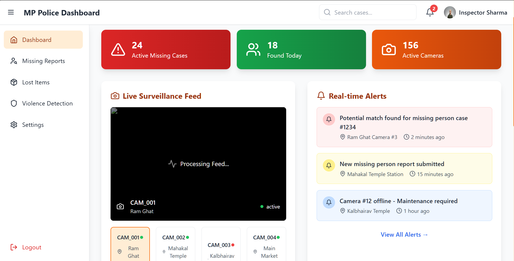
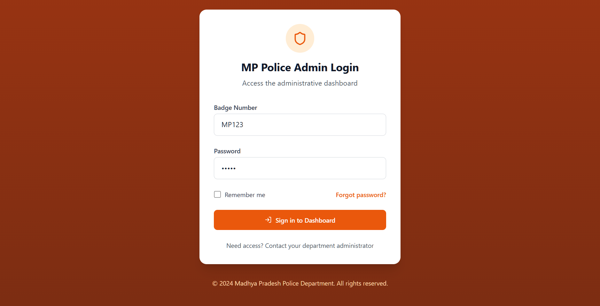
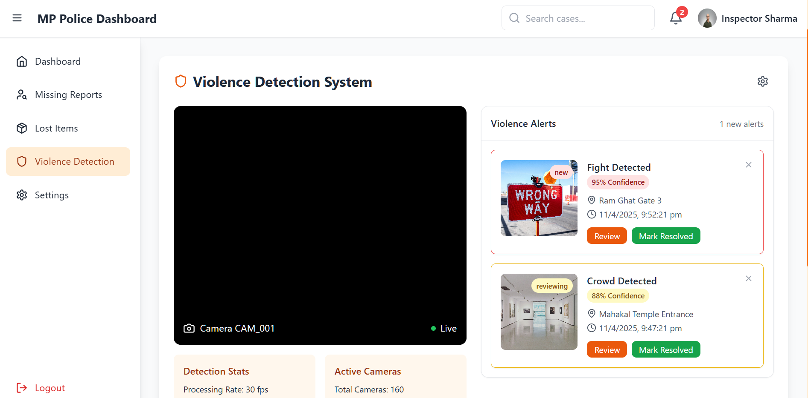

# Lost Person Tracker - Advanced Tracking System for Simhastha Mela

## Overview

The Simhastha Tracker is an advanced tracking system designed to enhance safety and security during the Simhastha Mela (a large Hindu gathering in Ujjain, India). This system leverages cutting-edge AI and facial recognition technology to assist in reuniting families and managing emergencies. It provides tools for reporting and locating missing persons, tracking the status of cases, and real-time surveillance with violence detection capabilities.

## Key Features
  
  

* **Missing Person Tracking:**
    * Allows users to report missing persons.
    * Utilizes an AI-powered system to process real-time data from surveillance cameras to locate missing individuals.
    * Displays details of missing person cases, including ID, age, gender, and last seen location.
    * Provides a search function to find missing persons and items.
  
  
* **Real-time Surveillance:**
    * Provides a live surveillance feed from multiple cameras at key locations (e.g., Ram Ghat, Mahakal Temple).
    * Includes a violence detection system that analyzes camera feeds to identify and alert authorities to potential incidents.
    * Displays camera status and processing rates.
  
  
* **Administrative Dashboard:**
    * Provides a secure login for authorized personnel (e.g., MP Police) to access the administrative dashboard.
    * Offers a comprehensive dashboard with key metrics, including active missing cases, found individuals, missing reports, lost items, and violence detection alerts.
    * Allows administrators to search cases, manage alerts, and monitor camera status.
  
  
* **Alert System:**
    * Generates real-time alerts for events such as potential matches for missing person cases, new missing person reports, and camera malfunctions.
    * Provides violence alerts with confidence levels and location details.

## Technologies Used

* AI and Facial Recognition
* Real-time Video Processing
* Web-based Interface

## Setup and Installation

[**Note:** The provided screenshots focus on the user interface.  To give accurate setup instructions, you'll need to add details about the backend technologies, database, etc., used in the project.  The following is a placeholder and needs to be replaced with your actual setup steps.]

1.  **Clone the repository:**

    ```bash
    git clone [your_repository_url]
    cd [your_project_directory]
    ```

2.  **Install dependencies:**

    ```bash
    #  Add specific installation instructions for your project's dependencies
    #  Example:
    npm install  or  pip install -r requirements.txt
    ```

3.  **Configure the application:**

    ```bash
    #  Describe any necessary configuration steps, such as setting up database connections, API keys, etc.
    #  Example:
    Create a .env file and add database credentials.
    ```

4.  **Run the application:**

    ```bash
    #  Provide commands to start the application (both frontend and backend if applicable)
    #  Example:
    npm start  or  python manage.py runserver
    ```